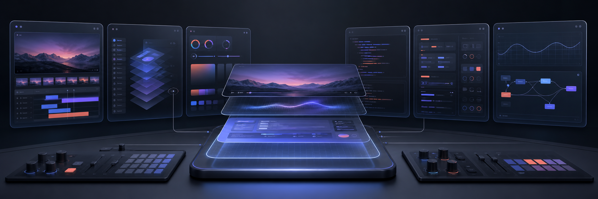
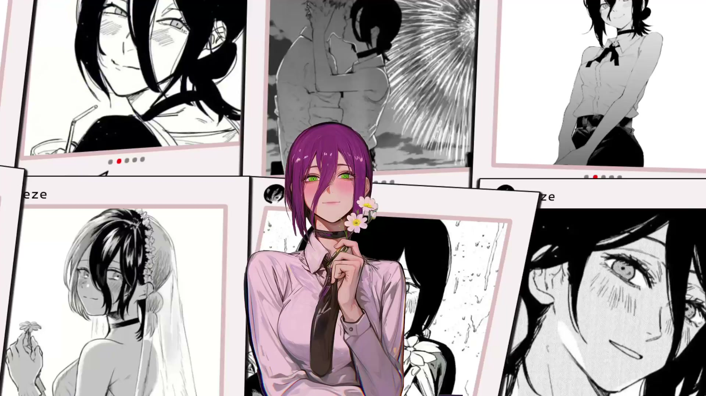
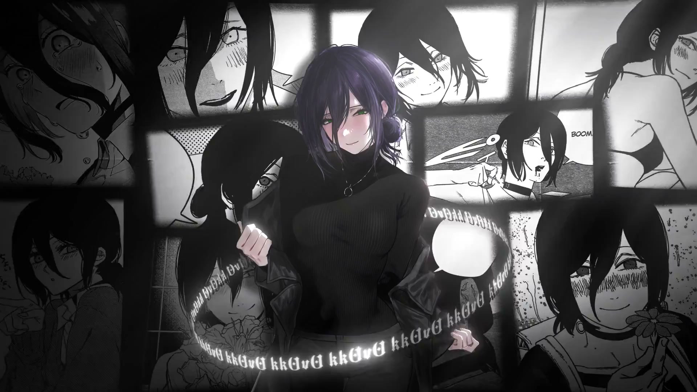
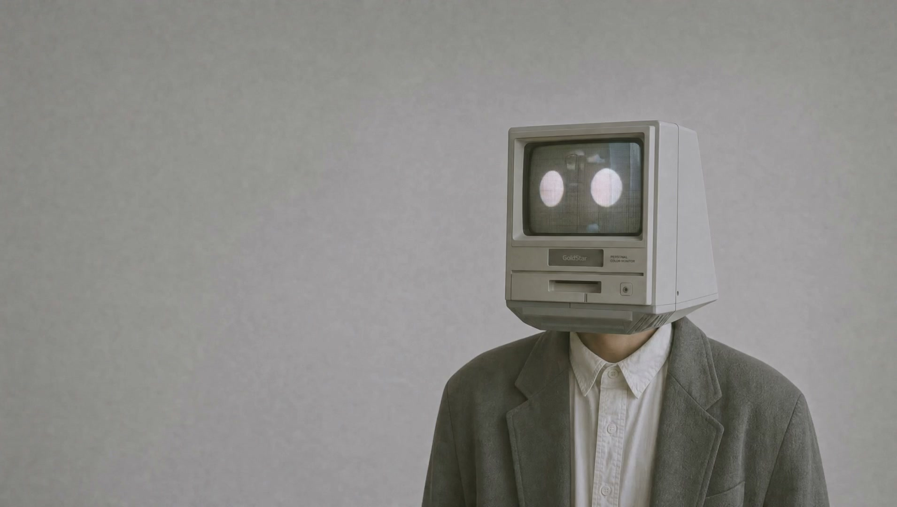

# Codex Skin Studio Complete

<p align="center">
  
</p>

<p align="center">
  面向 macOS Codex Desktop 的完整换肤引擎、两个创作 Skill 与六套可直接使用的皮肤。
</p>

<p align="center">
  <a href="https://github.com/minipopstyle/codex-skin-studio-complete/releases/latest">下载最新版</a>
  ·
  <a href="使用说明.md">完整使用说明</a>
  ·
  <a href="CHANGELOG.md">更新记录</a>
</p>

> 非官方界面定制项目。它不修改官方 Codex `.app`、`app.asar`、代码签名、API Key、模型供应商或中转配置。

## 这是什么

Codex Skin Studio Complete 把“换一个背景”扩展成了一套可继续创作的工作流：

```text
图片 / 视频 / 网页想法
        ↓
Video Skill 或 Web Skin Builder
        ↓
theme.json + poster.jpg + background.mp4
        ↓
统一 macOS 引擎
        ↓
安装、启动、验证、切换、停止或恢复
```

引擎负责安全地把视觉层应用到 Codex；Skill 负责理解用户需求、处理素材、生成皮肤包和执行验证。用户也可以让 Codex 在现有皮肤上继续改颜色、排版、动画和交互。

## 皮肤预览

| 视频皮肤 | 视频皮肤 |
| --- | --- |
| <br>IMG6275 | <br>女性角色-日漫 |
| <br>自由女神 | <br>长视频演示 |

| 网页皮肤 | 网页皮肤 |
| --- | --- |
| <br>Mainframe | <br>Velorah |

当前首页样式：`default`、`velorah`、`mainframe`。

## 包含内容

| 模块 | 用途 |
| --- | --- |
| 统一 macOS 引擎 | 启动、注入、调和、验证、停止和恢复皮肤 |
| `codex-video-skin` | 把本地视频处理成 CPU 友好的 Codex 视频皮肤 |
| `codex-web-skin-builder` | 从自然语言需求构建、验证和打包网页皮肤 |
| `skins/video/` | 四套视频皮肤及双击入口 |
| `skins/web/` | Velorah、Mainframe 与可继续编辑的预览源码 |
| `tests/` | 引擎、渲染器、图片元数据和主题暂存检查 |

## 快速开始

### 普通用户

1. 从 [Releases](https://github.com/minipopstyle/codex-skin-studio-complete/releases/latest) 下载 `Codex-Skin-Studio-Complete-*-client.zip`。
2. 解压后双击 `安装 Codex Skin Studio.command`。
3. 在 `skins/video/` 或 `skins/web/` 中选择皮肤，依次双击 `安装物料.command` 和 `启动皮肤.command`。

首次安装前，请先启动一次官方 Codex Desktop，使 `~/.codex/config.toml` 存在，然后关闭 Codex。

### 开发者

```bash
git clone https://github.com/minipopstyle/codex-skin-studio-complete.git
cd codex-skin-studio-complete
./scripts/install-dream-skin-macos.sh --no-launch
./tests/run-tests.sh
```

安装位置：

| 内容 | 路径 |
| --- | --- |
| 引擎 | `~/.codex/codex-dream-skin-studio` |
| 视频 Skill | `~/.codex/skills/codex-video-skin` |
| 网页 Skill | `~/.codex/skills/codex-web-skin-builder` |
| 主题和日志 | `~/Library/Application Support/CodexDreamSkinStudio` |

内部路径保留 `codex-dream-skin-studio` 名称仅用于兼容现有 Skill 和脚本。

## 我们探索出的技术

### 1. 不修改官方应用的运行时换肤

引擎不重新打包 Codex，也不写入 `app.asar`。它让官方 Codex 进程在 `127.0.0.1` 上开放本机 CDP，再把 CSS、DOM 和主题配置注入现有渲染器。关闭注入或执行恢复脚本后，可以回到官方外观。

### 2. 官方运行时与签名校验

启动前会检查：

- Codex 应用包标识和代码签名；
- 官方应用与其内置 Node.js 的签名团队是否一致；
- Node.js 架构和版本是否适合当前 Mac；
- CDP 监听端口是否属于预期的官方 Codex 进程。

视频 Skill 复用同一套检查，不另外实现一条更宽松的启动路径。

### 3. 可恢复的配置与进程状态

主题配置通过临时文件和重命名完成，降低半写入状态。引擎保存注入器 PID、启动时间、路径、端口和运行时身份；停止时只有完整身份匹配才会发送终止信号，避免误伤复用同一 PID 的其他进程。

主题目录默认使用 `700` 权限，主题文件默认使用 `600` 权限。

### 4. 低频调和，不做逐帧 DOM 扫描

Codex 页面会因路由、任务状态和 React 更新不断变化。共享渲染器使用带代次保护的调和流程，并以约 `240ms` 的节流处理突发变更，避免用 `requestAnimationFrame` 对整页进行持续扫描。

皮肤离开首页或停止时会清理自己的 DOM、监听器、计时器、对象 URL 和视频元素。

### 5. 视频首帧同步与有界播放

视频皮肤会：

- 移除音频并限制输出尺寸和体积；
- 从最终视频提取首帧海报，减少加载闪烁；
- 使用静音、内联、懒加载和可恢复的播放控制；
- 支持按需 60fps，而不是强制所有素材高负载播放；
- 在网页皮肤中支持无自动播放的横向鼠标拖动预览。

### 6. 预览层与注入层分离

网页皮肤可以用 React/Vite 快速设计和预览，但真正进入 Codex 的注入层保持为原生 DOM、CSS 和小型本地辅助函数。

```text
用户需求
  ├─ src/       React/Vite 预览与设计迭代
  ├─ engine/    Codex 内部的无依赖注入逻辑
  └─ theme/     海报、视频与 theme.json
```

这样既保留前端创作效率，也避免把开发服务器和整套前端运行时塞进 Codex。

## 技术边界

| 边界 | 当前结论 |
| --- | --- |
| 操作系统 | 仅支持 macOS 与官方 Codex Desktop |
| 分发方式 | ZIP 与 `.command`，不是签名或公证后的 DMG 应用 |
| 官方兼容性 | Codex DOM 或内置运行时升级后，选择器和启动检查可能需要同步更新 |
| CDP | 只绑定 `127.0.0.1`，但启用期间仍是本机敏感调试接口 |
| 网页运行时 | React/Vite 用于预览；活动注入层不能依赖开发服务器 |
| 首页样式 | 内置三种；新增完全不同的交互布局需要扩展注入器分支和 CSS |
| 原生功能 | 皮肤不得遮挡侧栏、任务区、输入框、设置页等原生交互 |
| 视频处理 | 创建新视频皮肤需要 `ffmpeg` 和 `ffprobe` |
| 素材 | 默认使用本地素材；发布者需要自行确认公开分发权利 |
| 安全承诺 | 不读取密钥、不修改模型配置，也不保证第三方皮肤脚本安全 |

启用皮肤时不要运行不可信的本地程序。使用结束后可以执行恢复脚本关闭注入。

## 让 Codex 继续二次创作

推荐把完整仓库交给 Codex，而不是只复制 Skill、CSS 或一个素材文件。下面的提示词可以直接使用。

### 把自己的视频做成皮肤

```text
使用 codex-video-skin，把我提供的视频制作成新的 Codex 视频皮肤。
保留原生侧栏、任务区和输入框；移除音频，生成同步首帧海报，
先验证再应用，最后告诉我如何停止皮肤和恢复官方外观。
```

### 基于现有网页皮肤改版

```text
使用 codex-web-skin-builder，以 skins/web/Mainframe 为基础制作一个新的网页皮肤。
视觉要求：深色、低饱和、信息面板更克制。
交互要求：保留 Codex 原生导航，只让自定义按钮接收点击。
不要修改官方 app、app.asar、API Key 或模型配置。
完成后运行构建、皮肤验证和截图检查。
```

### 改现有皮肤而不复制引擎

```text
基于 skins/video/自由女神 调整色彩、标题、人物位置和背景遮罩。
复用统一 Skin Studio 引擎，不创建第二套渲染器。
保持 theme.json、poster.jpg 和 background.mp4 的引用一致，
验证通过后再打包并应用。
```

### 创建新的首页交互

```text
为 Codex Skin Studio Complete 新增一种 homepageStyle。
先复用现有调和、清理和路由检测机制，再添加最小的渲染分支和 CSS。
自定义覆盖层默认 pointer-events: none，只有明确的交互控件可以接收点击。
同时检查首页、任务页、设置页、窄窗口和恢复流程。
```

完整输入规范、架构说明和验收清单位于：

- [`skills/codex-web-skin-builder/references/input_schema.md`](skills/codex-web-skin-builder/references/input_schema.md)
- [`skills/codex-web-skin-builder/references/architecture.md`](skills/codex-web-skin-builder/references/architecture.md)
- [`skills/codex-web-skin-builder/references/acceptance_checklist.md`](skills/codex-web-skin-builder/references/acceptance_checklist.md)

## 验证与恢复

```bash
./tests/run-tests.sh
~/.codex/codex-dream-skin-studio/scripts/doctor-macos.sh --require-live
~/.codex/codex-dream-skin-studio/scripts/verify-dream-skin-macos.sh --reload
~/.codex/codex-dream-skin-studio/scripts/restore-dream-skin-macos.sh \
  --restore-base-theme --restart-codex
```

只有引擎检查通过，并确认首页、侧栏、任务内容、输入框和设置页仍可操作，才算皮肤应用完成。

## 项目结构

```text
.
├── assets/       共享渲染器、CSS 与默认主题
├── scripts/      macOS 安装、启动、验证、恢复与发布脚本
├── skills/       视频皮肤与网页皮肤两个 Codex Skill
├── skins/        四套视频皮肤与两套网页皮肤
├── tests/        最小但可运行的回归检查
├── README.md
└── 使用说明.md
```

## 安全与说明

- [完整使用说明](使用说明.md)
- [非官方声明与素材说明](NOTICE.md)
- [MIT License](LICENSE)
